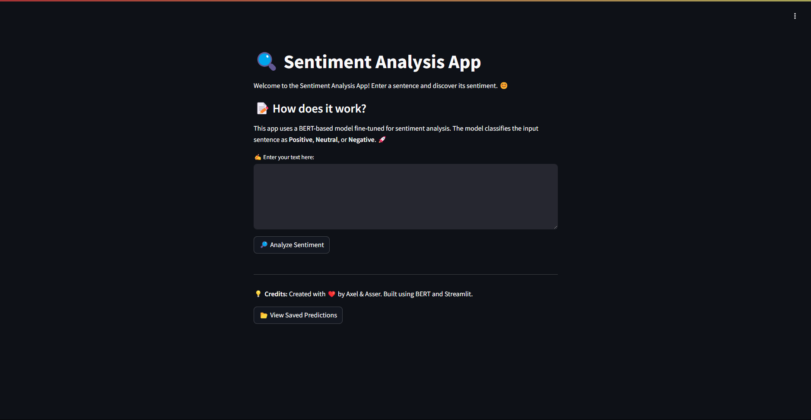
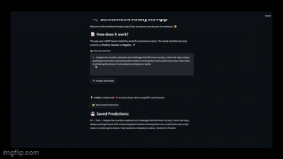
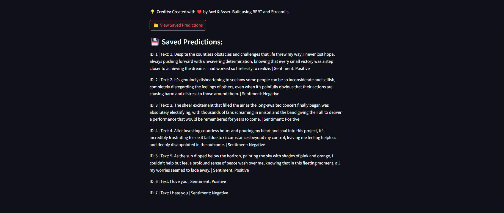
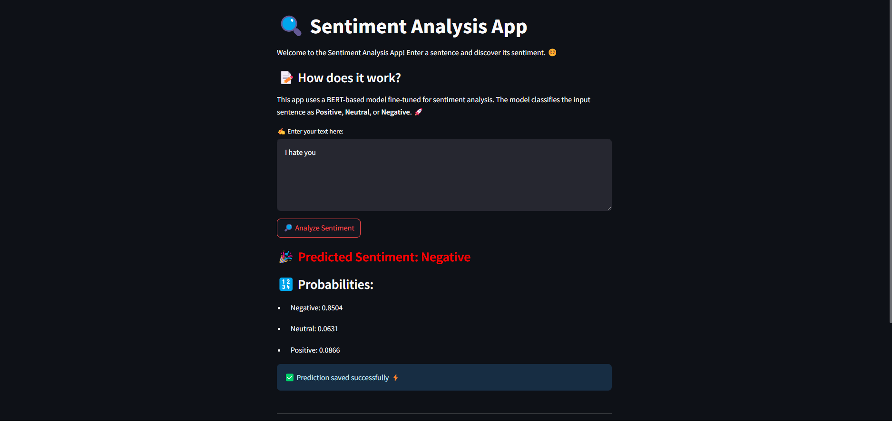
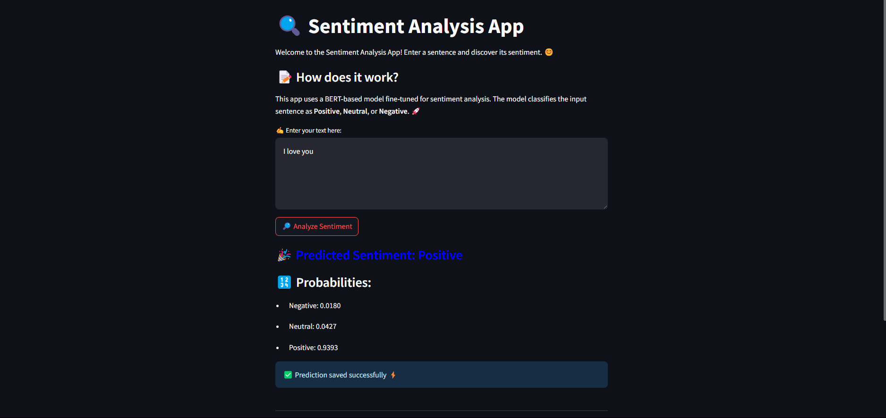

# Sentiment Analysis App 🌟

Welcome to the Sentiment Analysis App AKA the SentAnalyzer! This project leverages a BERT-based model to predict the sentiment of a given sentence as Positive, Neutral, or Negative. The application is built for those who wants to create their own dataset based on text and sentiment. This app uses a simple Ui using streamlit and a prediction saving system to construct progressively your dataset.

## 📑 Table of Contents

1. [🌲 Project Structure](#-project-structure)
2. [🚀 Features](#-features)
3. [🔥 Demo](#-demo)
4. [📝 Installation](#-installation)
5. [🧠 How It Works](#-how-it-works)
6. [📂 Saved Predictions](#-saved-predictions)
7. [🧪 Running Tests](#-running-tests)
8. [📝 Technical Details and Results](#-technical-details-and-results)
    - [Data Extraction and Processing](#data-extraction-and-processing)
    - [Model Architecture](#model-architecture)
    - [Training and Inference Results](#training-and-inference-results)
9. [👨‍💻 Streamlit Sentiment Analysis App](#-streamlit-sentiment-analysis-app)
10. [GitHub automation and Containerization with Docker](#cicd-workflows-github-actions)
11. [🙏 Credits](#-credits)
12. [🌐 License](#-license)
13. [💡 Future Improvements](#-future-improvements)


## 🌲 Project Structure

```
📦 
├─ .gitattributes
├─ .github
│  └─ workflows
│     ├─ build.yml
│     ├─ evaluate.yml
│     └─ test.yml
├─ .gitignore
├─ Dockerfile
├─ LICENSE
├─ README.md
├─ assets
│  ├─ gif
│  │  └─ demo.gif
│  └─ images
│     ├─ build_workflow.png
│     ├─ color_negative.png
│     ├─ color_positive.png
│     ├─ inference_log_1.png
│     ├─ inference_log_2.png
│     ├─ run_docker_image_1.png
│     ├─ run_docker_image_2.png
│     ├─ saved_predictions.png
│     ├─ streamlit_app.png
│     ├─ training_log.png
│     ├─ training_log_1.png
│     ├─ training_log_2.png
│     └─ training_log_3.png
├─ docker-compose.yml
├─ metrics.json
├─ models
│  └─ best_model.pt
├─ predictions.json
├─ requirements.txt
├─ src
│  ├─ __init__.py
│  ├─ __pycache__
│  │  ├─ __init__.cpython-312.pyc
│  │  ├─ data_extraction.cpython-312.pyc
│  │  ├─ data_processing.cpython-312.pyc
│  │  ├─ inference.cpython-310.pyc
│  │  ├─ inference.cpython-312.pyc
│  │  └─ model_training.cpython-312.pyc
│  ├─ app.py
│  ├─ data_extraction.py
│  ├─ data_processing.py
│  ├─ evaluation.py
│  ├─ get_performance.py
│  ├─ inference.py
│  ├─ model_training.py
│  ├─ predictions.json
│  └─ reviews.csv
└─ tests
   ├─ __init__.py
   ├─ __pycache__
   │  └─ __init__.cpython-312.pyc
   └─ unit
      ├─ __init__.py
      ├─ __pycache__
      │  ├─ __init__.cpython-312.pyc
      │  ├─ test_data_extraction.cpython-312-pytest-8.3.5.pyc
      │  ├─ test_data_extraction.cpython-312.pyc
      │  ├─ test_data_processing.cpython-312-pytest-8.3.5.pyc
      │  ├─ test_inference.cpython-312-pytest-8.3.5.pyc
      │  └─ test_model_training.cpython-312-pytest-8.3.5.pyc
      ├─ test_data_extraction.py
      ├─ test_data_processing.py
      ├─ test_inference.py
      └─ test_model_training.py

```


## 🚀 Features

  - Real-Time Sentiment Analysis: Enter any text and get instant sentiment predictions.
  - BERT-Based Model: Uses a fine-tuned BERT model for accurate sentiment classification.
  - Interactive UI: Built with Streamlit for a smooth and user-friendly experience.
  - Prediction History: Saves predictions with an ID and the corresponding sentiment.
  - Exportable Predictions: Predictions are saved in a JSON file for easy access and analysis.

## 🔥 Demo

Check it out, here is a very small demo of the app!!



Gif of the demo: 




## 📝 Installation

1. Clone the repository:
   ```
   git clone https://github.com/vsx23733/Sent-Analyser.git
   cd Sent-Analysis
   ```

2. Create and activate a virtual environment:
   ```
   python -m venv .venv
   source .venv/bin/activate
   # On Windows: .venv\Scripts\activate
   ```

3. Install the required packages:
   ```
   python -m pip install --upgrade pip
   python -m pip install -r requirements.txt
   ```

4. ⚠️ Download the model manually:
If you want to use our pretrained model, you’ll need to manually download it and place it in the model/ directory, as it is not included when cloning the repository.

5. Run the Streamlit app:
   ```
   streamlit run src/app.py
   ```

## 🧠 How It Works

1. The user inputs a sentence through the UI.
2. The sentence is processed by the BERT-based model to predict the sentiment.
3. The prediction and probabilities are displayed on the screen.
4. The result is saved in predictions.json for future reference.


## 📂 Saved Predictions

The predictions are stored in predictions.json in the following format:
```
{
    "1": ["I love this app!", "Positive"],
    "2": ["It is okay, not the best.", "Neutral"],
    "3": ["I hate waiting!", "Negative"]
}
```

## 🧪 Running Tests

Unit tests are located in the tests/unit directory. You can run them using:
```
pytest tests/unit
```

## 📝 Technical Details and Results

This section covers the technical details of the model, training process, evaluation metrics, and detailed performance analysis.

### Data Extraction and Processing

The data extraction and processing workflow is essential for preparing the dataset for sentiment analysis using the BERT-based model. This part of the project is responsible for loading the raw data, processing it into a usable format, and transforming the reviews into sentiment labels. Below is a detailed breakdown of the functions and classes involved in the data extraction and processing process.
- Data Extraction
    The first step is to load the data from the provided CSV file containing the Google reviews. The load_data() function reads the CSV file into a pandas DataFrame.
  
- Sentiment Labeling
    To convert the ratings from the reviews into sentiment scores, the to_sentiment() function maps the ratings to a corresponding sentiment:
      Negative sentiment (0) for ratings 1-2.
      Neutral sentiment (1) for rating 3.
      Positive sentiment (2) for ratings 4-5.
    The create_sentiment_column() function applies the to_sentiment() function to the entire dataset and adds a new column for sentiment labels.
  
- Data Processing for Model Input
    Once the sentiment labels are added to the DataFrame, the next step is to preprocess the reviews so they can be fed into the BERT model. The function preprocess_reviews_processing() tokenizes the review content and converts the data      into the format expected by BERT. It returns:
         - input_ids: The tokenized input data for BERT.
         - attention_mask: The attention mask to tell BERT where to focus during attention mechanisms.
         - labels: The sentiment labels for each review.

- Dataset and Dataloader
    To efficiently load the data into the model, we use the SentimentDataset class, which wraps the preprocessed data into a PyTorch dataset. The function prepare_dataloader() manages the complete pipeline for loading, processing, and        splitting the dataset into training and testing sets, then returning PyTorch DataLoaders for each and the function returns the train_loader and the test_loader.

    


### Model Architecture

The model architecture for this sentiment analysis task is based on BERT (Bidirectional Encoder Representations from Transformers), which is pre-trained on vast amounts of text data and fine-tuned for downstream tasks such as sentiment classification. In this project, we use BERT for Sequence Classification from the Hugging Face Transformers library to build a robust model for classifying the sentiment of Google reviews.

- Pretrained BERT Model (BertForSequenceClassification)
    The core of the model is BERT, specifically the BertForSequenceClassification variant, which is designed to perform sequence classification tasks, such as sentiment analysis. This model is pretrained on the English Wikipedia and          BookCorpus datasets, allowing it to understand general language patterns, semantics, and syntax.
    The model uses the [CLS] token at the beginning of the input sequence to aggregate information and predict the class for the entire sequence (sentiment). The output is passed through a classification head (a dense layer) to generate      the final sentiment prediction.

- Classification Head
    The classification head is a dense layer that takes the output from the [CLS] token (which represents the entire review) and performs a final classification into one of three sentiment categories: Negative (0), Neutral (1), and           Positive (2). The BertForSequenceClassification model has a linear classification layer on top of the BERT transformer, which is the final layer used to predict the sentiment label. The output layer has 3 units corresponding to the 3     sentiment classes.

- Optimizer and Loss Function
    Optimizer: We use the AdamW optimizer (a variant of Adam optimized for weight decay), which is widely used for training transformer models. The learning rate is set to 2e-5, a typical value for fine-tuning BERT.
    Loss Function: The model uses cross-entropy loss, which is appropriate for multi-class classification tasks. The loss is computed based on the predicted class probabilities and the true sentiment labels.

- Training and Evaluation Loop
    Training: In each training epoch, the model goes through the training dataset (using the train_epoch function). For each batch, the model computes the loss, performs backpropagation, and updates the weights.
    Evaluation: After every epoch, the model is evaluated on the validation set using the evaluate function. The evaluation calculates the loss and accuracy, and generates a classification report that provides detailed metrics such as        precision, recall, and F1-score for each sentiment class.

- Hyperparameters:
    ```
    BATCH_SIZE = 16
    EPOCHS = 3
    LEARNING_RATE = 2e-5
    ```

- Model Saving
    After each evaluation, the model checks if the current validation accuracy is the best it has achieved so far. If so, the model is saved to the disk as best_model.pt in a directory named models. This ensures that the best-performing      model during training is preserved for later use.

- Device Management (GPU/CPU)
    The model is designed to work on either a GPU (if available) or a CPU. The device is determined dynamically based on the hardware, and the model, as well as the data, is moved to the appropriate device using
    ```
    .to(device).
    ```


### Training and Inference Results

The model was trained on a dataset of Google reviews, and we evaluated its performance based on several metrics, including training loss, validation loss, and classification accuracy.

- Training Loss and Accuracy
    During the training process, we monitored the training loss and accuracy for each epoch. The loss decreased progressively, indicating that the model was learning from the data. The accuracy also improved     as the training proceeded, reflecting the model's increasing ability to correctly classify sentiments. After each epoch, we evaluated the model on the validation set to measure its performance more           comprehensively. We used metrics such as precision, recall, and F1-score for each sentiment class (Negative, Neutral, and Positive).
  
    Epoch 1:
  
    

    Epoch 2:
  
    

    Epoch 3:
  
    


- Inference Logs
    Finally, during the inference phase, the model was used to predict the sentiment of new reviews. The logs below show the model's predictions on sample inputs, including the predicted sentiment and the corresponding probabilities for      each class.

    Positive sentiment prediction inference: 

    

    Negative sentiment prediction inference: 

    


### 👨‍💻 Streamlit Sentiment Analysis App

Once the app is running, you will see a clean and interactive UI that prompts you to enter your text. The key elements of the UI include:

  - Text Area: Where you can input the sentence for sentiment analysis.
  - "Analyze Sentiment" Button: Click this button to trigger the sentiment prediction.
  - Prediction Results: After clicking the button, the app displays the predicted sentiment along with probabilities for each sentiment class.
  - Saved Predictions: You can click on "View Saved Predictions" to see all previously analyzed sentences and their corresponding sentiment scores.

  

The app automatically saves every prediction, including:

  - Sentence: The sentence you entered for analysis.
  - Sentiment: The predicted sentiment (Positive, Neutral, Negative).

  

  - Color mapping system (color of the text change based on the predicted sentiment)

  Negative sentiment: 
  

  Positive sentiment:
  


## **Docker Setup**

### **Dockerfile**
The `Dockerfile` defines how the containerized application is built and run. The key steps include:

1. **Base Image**  
   - Uses `python:3.12.7-slim` as the base image, which is a lightweight version of Python 3.12.7.

2. **Working Directory**  
   - Sets `/app` as the working directory inside the container.

3. **Copying Dependencies and Model**  
   - Copies `requirements.txt` for dependency installation.
   - Copies `best_model.pt` to ensure the model is available in the container.

4. **Dependency Installation**  
   - Installs required Python packages using `pip` with `--no-cache-dir` to keep the image lightweight.

5. **Creating Persistent Storage Directories**  
   - Ensures `/app/models`, `/app/logs`, and `/app/data` exist inside the container.

6. **Copying Application Source Code**  
   - Copies the `src/` directory (which contains the application logic) and `README.md`.

7. **Exposing Ports**  
   - Exposes port `8501`, which is used by Streamlit.

8. **Defining the Entry Point**  
   - Sets the default command to run Streamlit using `CMD ["streamlit", "run", "src/app.py"]`.

---

### **Docker Compose (`docker-compose.yml`)**
The `docker-compose.yml` file defines how the containerized application should be orchestrated. The main parts:

1. **Service Definition (`sentiment_predictor`)**  
   - Specifies the container name: `sentiment_predictor`.
   - Builds the container from the `Dockerfile`.
   - Maps port `8501` from the container to `8501` on the host.

2. **Persistent Storage with Volumes**  
   - Mounts three volumes:
     - `sentiment_models` → `/app/models`
     - `sentiment_logs` → `/app/logs`
     - `sentiment_data` → `/app/data`
   - This ensures data is preserved between container restarts.

3. **Environment Variables**  
   - Defines `DEVICE=cpu` to configure inference to run on the CPU.

4. **Network Configuration**  
   - Uses `sentiment_net` network with a bridge driver for isolated communication between containers.

---

## **CI/CD Workflows (GitHub Actions)**

### **Test Workflow (`test.yaml`)**
This workflow ensures the code is properly tested before merging into `master`. It does:

1. **Triggers**  
   - Runs on pushes and pull requests targeting the `master` branch.

2. **Job: `test`**  
   - Runs on `ubuntu-latest`.

3. **Steps:**
   - **Checkout repository** → Pulls the latest code from GitHub.
   - **Set up Python** → Uses Python 3.12.7.
   - **Install dependencies** → Installs required Python libraries from `requirements.txt`.
   - **Run unit and integration tests** → Uses `pytest` to test code inside `tests/unit`.
   - **Code reformatting** → Uses `black` to auto-format code.
   - **Linting** → Runs `pylint` to check for code quality issues.

---

### **Model Evaluation Workflow (`evaluate.yaml`)**
This workflow ensures the model performs above a predefined threshold before deployment.

1. **Triggers**  
   - Runs on pushes and pull requests to `master`.

2. **Job: `evaluate`**  
   - Runs on `ubuntu-latest`.

3. **Steps:**
   - **Checkout repository** → Pulls the latest code.
   - **Set up Python** → Installs Python 3.12.7.
   - **Load and evaluate model** → Runs `evaluation.py` to assess model performance.
   - **Store evaluation metrics** → Saves `metrics.json` as an artifact.
   - **Fail if performance is below threshold**  
     - Runs `get_performance.py`, extracts the model performance score, and fails if it's below `0.59`.

---

### **Docker Build Workflow (`build.yaml`)**
This workflow automates the process of building and pushing the Docker image to DockerHub.

1. **Triggers**  
   - Runs on pushes and pull requests to `master`.

2. **Job: `build`**  
   - Runs on `ubuntu-latest`.

3. **Steps:**
   - **Checkout repository** → Pulls the latest code.
   - **Set up Docker Buildx** → Enables advanced Docker image building features.
   - **Log in to DockerHub** → Uses `DOCKER_USERNAME` and `DOCKER_PASSWORD` secrets for authentication.
   - **Build Docker image** → Builds the image with the tag `menegraal/sent_predictor:latest`.
   - **Push to DockerHub** → Uploads the image to the Docker registry.

---

This setup ensures:
- **Code quality and testing** before merging (`test.yaml`).
- **Model evaluation** to maintain accuracy (`evaluate.yaml`).
- **Automated container builds and deployments** (`build.yaml`).
- **A lightweight, efficient Dockerized environment** for deployment.


## 🙏 Credits

- Created with ❤️ by Axel & Asser.
- Built using Python, Streamlit, PyTorch, and Transformers.
- Model based on BERT from the Hugging Face library.

## 🌐 License

This project is licensed under the MIT License. See the LICENSE file for details.

## 💡 Future Improvements

  - Integrate more sentiment labels for fine-grained classification.
  - Add multi-language support.
  - Enhance model accuracy with fine-tuning on additional datasets to better predict the neutral class.
  - Improve the UI with more visualizations and insights.
